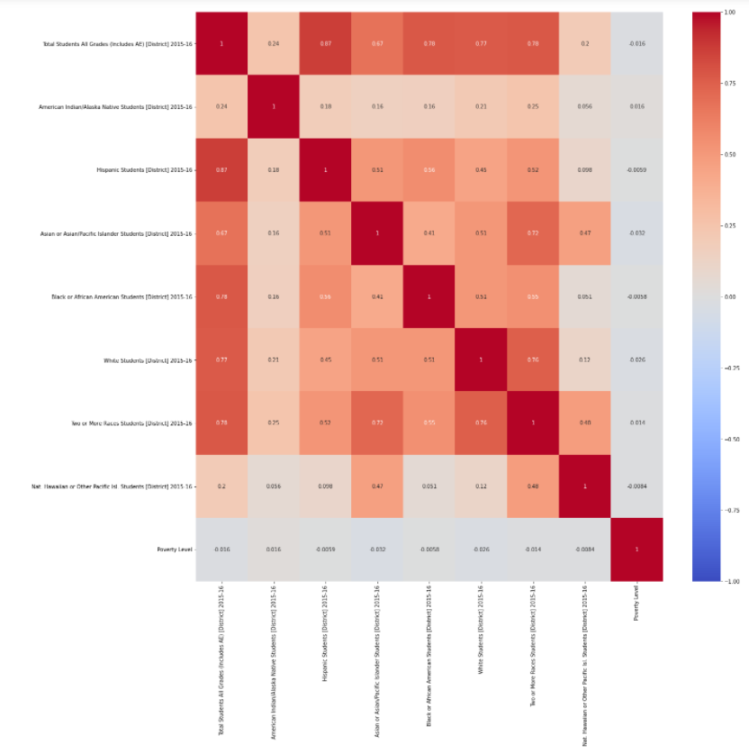
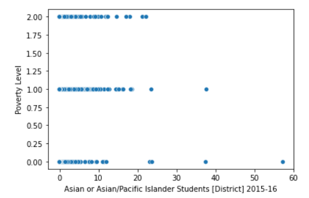
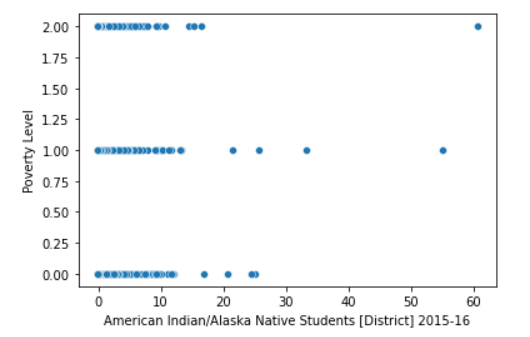
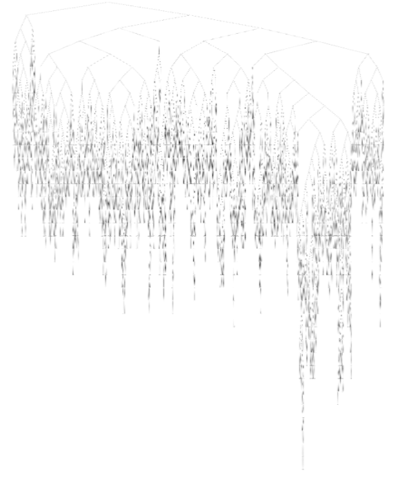
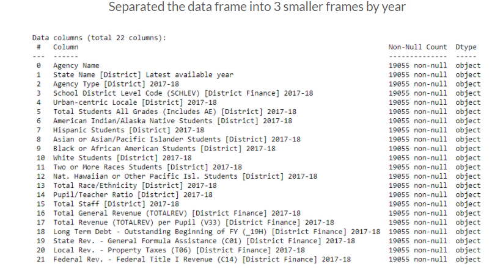
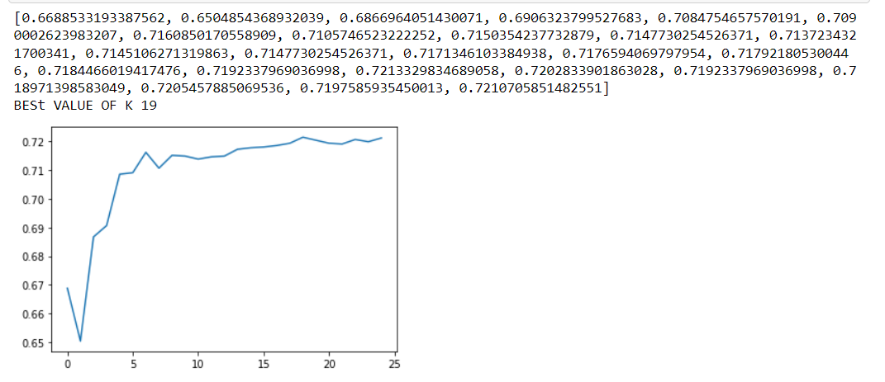
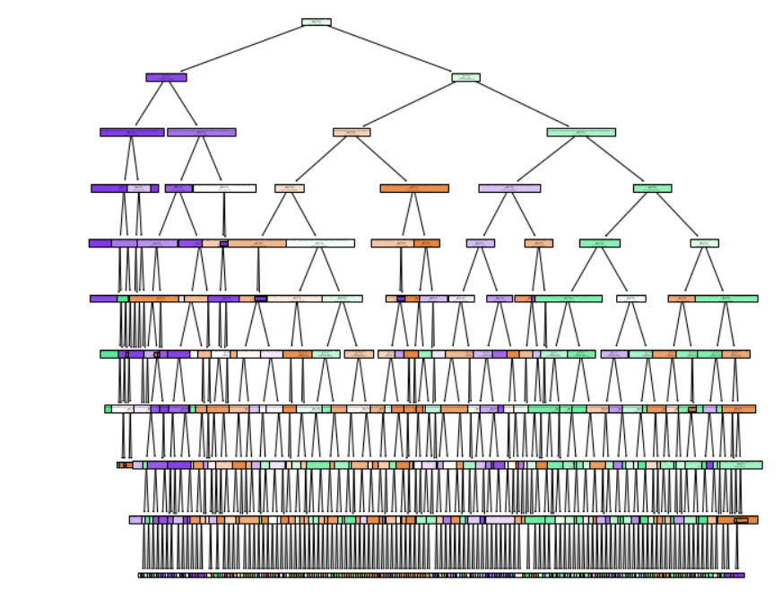

# ML Benchmark
## Authors
Christopher Metzler, Shehani De Silva, Deverell, Malachi Buchheit, Bailey Trip

## Introduction

The Common Core of Data (CCD) is the Department of Education's primary database on public elementary and secondary education in the United States. CCD is a comprehensive, annual, national database of all public elementary and secondary schools and school districts. There are seven categories of data. Within each category, data are organized by year. Within each year, there are four or five different data files. The overall objective of this benchmark is to design and evaluate prediction of high poverty stricken school from the publicly available data, and to evaluate the value of Title 1 school designation.

## Problem Statement 

The overall objective is to design and evaluate prediction of high poverty stricken schools from the publicly available data accross the U.S., and to evaluate the value of Title 1 school designation. The resulting model might grant insight into the factors critical to the success of school districs.

# Dataset link: https://nces.ed.gov/ccd/files.asp

The data spans from 2015 to 2018 (3 school years). Schools began reporting more varieties of data in 2015 than previous years, and 2018 is the latest year fiscal data is available. Thus, this selection allows for the greatest range of data.

* Our model will be considered successful if it shows higher than 60% accuracy in testing and validation.

## Data Management 

### Evaluating the Solution
What evaluation metrics did you use?  
  * Test/train split testing on linear regression and decision tree models  
  * Heatmap to determine correlation between Poverty level and other columns from the pulled data  
  * Scatterplots to visualize the distribution of Poverty label based on Pupil/Teacher Ratio and American Indian/Alaska Native Students   

After analyzing the heatmap it was observed that the Asian or Pacific Islander column is in most negative correlation while the American Indian/Alaskan native students column is in most postive correlation with the poverty column.

* We used a basic linear regression as a baseline model. It performed poorly, but better than random with a testing score of 0.38147570792025276 (⅓ chance is random). We also trained a decision tree classifier which scored perfectly on the training sample and 0.7160850170558909 on the testing sample. The score of 1 on training data might indicate that some feature is directly correlated with our label, or that this model overfits. The idea that it overfits is supported by the image of the tree below, which shows a massive set of decision nodes.

* We decided to go with KNN after optimization and testing due to its computational performance and accuracy when compared to Decision Tree.

### Data Gathering

* The data spans from 2015 to 2018 (3 school years). Schools began reporting more varieties of data in 2015 than previous years, and 2018 is the latest year fiscal data is available. Thus, this selection allows for the greatest range of data. Our data is by district not by school.

* Include informal success measures (e.g. accuracy on cross-validated data, without specifying ROC or precision/recall etc) that you planned to use.
Our model will be considered successful if it shows higher than 60% accuracy in testing and validation. The scores for the cross fold validation were 0.73 across 3, 4, and 5 fold.

* Justify your methods in terms of the problem statement. What did you consider but *not* use? In particular, be sure to include every method you tried, even if it didn't "work". When describing methods that didn't work, make clear how they failed and any evaluation metrics you used to decide so. How was that a data-driven decision? 
	-We tried using scatterplots to visualize the correlation between poverty level-Pupil/Teacher Ratio and poverty level - American Indian/ Alaska Native Students.

### Data Pre-processing, Cleaning, Labeling, and Maintenance 

* The main dataframe (exploritory.csv) was divided into years: 2015-16, 2016-17, and 2017-18.

* Data Cleaning:
Data was cleaned using pandas for NaN's. 
Uninterpretable strings were processsed as value 0.
For each data frame we filled NaN’s with 0 using pandas.
Then we set the real value columns and categorical column labels.
We used pandas get_dummies for our categorical variables.
We also used pandas to_numeric to interpret non-numerical data. 

* Data Normalization:
Important to bring all the features to the same scale using z-score normalization method. 
We did normalization on real value columns because we thought normalized data work better on KNN models

* Poverty labels were determined by the total revenue per pupil. 
Strict Poverty: Total Revenue for the District is less than $10,000
High Poverty: Total Revenue for the District is less than $15,000
No Poverty: Total Revenue for the District is greater than $15,000

* Catagorical variables were assigned to dummy variables to allow for interpretation in our model.

### Describe the ML methods that you used and the reasons for their choice. 

What is the family of machine learning algorithms you are using and why? 
* Regression or classification?
    
    Models we tried were linear regression and decision tree which are both supervised learning. We tried both regression and classification to see what works best on our data.
    We then decided to move forward with classification algorithms since we wanted to identify the category of new observations on the basis of training data. 
    Later we tried KNN for a better fit to our data. We found our best value of k to be 19.
    We used decision tree again, implementing pipeline to determine stopping criteria and evaluating with cross validation.

### Tools and Infrastructure Tried and Not Used

Describe any tools and infrastruicture that you tried and ended up not using. What was the problem?     
	* We initially tried linear regression but realized that classification would be a better fit for the problem we are trying to solve.

## Experiments

We set up our training/testing data as follows:
* 2015-16 used as training data
* 2016-17, 2017-18 were used as testing data.

Models we have evaluated and optimized:
* KNN: k equal to 19
* Decision Tree: Max depth 10, splitting criteria as best.
** Using crossfold with gridsearchCV we obtained optimal stopping criteria and a return score function for KNN.

Decision Tree outperformed on training data while the optimized models produced different results on testing data.
* KNN optimized outperforms Decision Tree optimized on testing data for both years by an average of 10%

 

## Machine Learning Approaches

### KNN Classification Model  

* We started with the KNN classification model
* Used return score function to optimize the value of k, which was found to be k=19
	

* Using best parameters k = 19 and outputting score for our test data : 0.6639333508265547 0.6393991078457097  

### Decision Tree Model

* We also decided to implement a decision tree model because it is easy to interpret the data.
* Decision Tree model done with max depth 10 and splitter set to best for intitial evaluation
* The scores were : 0.7765678299658882, 0.7299921280503805 on training data.

* Then we used sklearn pipeline to scale the data and find optimal decision tree stopping criteria with cross fold validation.

## Conclusions

* Using race/ethnicity and student statistics at a district level as a poverty predictor gives us 65% accuracy (KNN) on testing data.
* Decision Tree performs better on training data while KNN optimized. Our Decision Tree was overfitting on the training data.
* We decided to go with KNN after optimization and testing due to its computational performance and accuracy when compared to Decision Tree.
